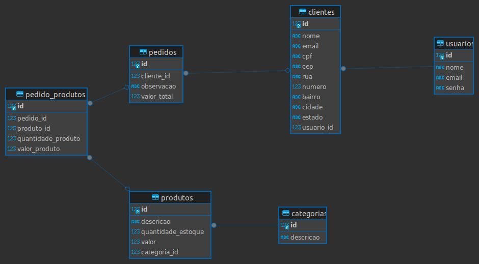

# Seja bem vindo(a) ao ProjetoPDV 💻 🛒

Criei uma API para um PDV (Frente de Caixa ou Ponto de Vendas).

A finalidade da API PDV é cadastrar usuários, clientes e produtos.

Usuários previamente registrados na plataforma podem acessar a base de dados, incluir produtos em um pedido que será entregue ao cliente.

O banco de dados e a camada de storage(para salvar as imagens dos produtos) estão "deployados" na nuvem.

O projeto foi desenvolvido com auxílio de um quadro kanban e em 3 sprints nas quais suas atividades estão descritas aqui, ao mesmo tempo que explico o projeto.

Esse é um projeto piloto, ou seja, no futuro outras funcionalidades serão implementadas.


## Tecnologias utilizadas: 🛠️

- Javascript
- ExpressJs
- Node.js
- AWS-SDK (S3)
- PostgreSQL
- Backblaze
- Bcrypt
- JWT
- Knexjs


**Importante 1: Sempre que a validação de uma requisição falhar, é exibida uma responda com código de erro e mensagem adequada à situação.**

**Importante 2: Para endpoints de cadastro/atualização os objetos de requisição devem conter as propriedades equivalentes as colunas das tabelas.**

**Exemplo:**

```javascript
// Corpo da requisição para cadastro de usuário (body)
{
    "nome": "José",
    "email": "jose@email.com",
    "senha": "jose"
}
```


## **ATENÇÃO:**
- Qualquer valor monetário deverá ser representado em centavos (Ex.: R$ 10,00 reais = 1000)

<br>

# 1ª Sprint

# Banco de dados:
Criei um Banco de Dados online PostgreSQL via <https://www.elephantsql.com/>

**No projeto existe um arquivo SQL que é o script que contém os comandos de criação das tabelas respeitando os nomes das tabelas e colunas respectivamente, além de conter os comandos para a inserção das categorias.**

Aqui abaixo está uma representação do Modelo Entidade-Relacionamento do banco de dados da aplicação.

 

<br>

# Endpoint/Recursos

## Listar categorias

#### `GET` `/categoria`

<https://graceful-bass-earmuffs.cyclic.app/categoria>

Essa é a rota que é chamada quando o usuário quiser listar todas as categorias cadastradas.

As categorias abaixo foram previamente cadastradas para que sejam listadas neste endpoint.

## **Categorias**

-   Informática
-   Celulares
-   Beleza e Perfumaria
-   Mercado
-   Livros e Papelaria
-   Brinquedos
-   Moda
-   Bebê
-   Games


## Cadastrar usuário

#### `POST` `/usuario`
<https://graceful-bass-earmuffs.cyclic.app/usuario>

Essa é a rota que é utilizada para cadastrar um novo usuário no sistema.

Critérios de aceite:

    - Campos obrigatórios: 
        - nome
        - email
        - senha
    - A senha é criptografada.
    - O campo e-mail é único.


## Efetuar login do usuário

#### `POST` `/login`
<https://graceful-bass-earmuffs.cyclic.app/login>

Essa é a rota que permite ao usuário cadastrado realizar o login no sistema.

Critérios de aceite:

    - O sistema valida se o e-mail e a senha estão corretos para o usuário em questão.
    - O sistema gera um token interno de autenticação para o usuário.


---

## **ATENÇÃO**: Todas as funcionalidades (endpoints) abaixo, exigem o token de autenticação do usuário logado, recebendo no header com o formato Bearer Token. Portanto, em cada funcionalidade há validação de token.


## Detalhar perfil do usuário logado

#### `GET` `/usuario`
<https://graceful-bass-earmuffs.cyclic.app/usuario>

Essa é a rota que permite ao usuário logado visualizar os dados do seu próprio perfil, de acordo com a validação do token de autenticação.

## Editar perfil do usuário logado

#### `PUT` `/usuario`
<https://graceful-bass-earmuffs.cyclic.app/usuario>

Essa é a rota que permite ao usuário logado atualizar informações de seu próprio cadastro, de acordo com a validação do token de autenticação.

Critérios de aceite:

    - Campos obrigatórios: 
        - nome
        - email
        - senha
    - A senha é criptografada.
    - O campo e-mail deve ser único.


---

# 2ª Sprint
## Cadastrar Produto

#### `POST` `/produto`
<https://graceful-bass-earmuffs.cyclic.app/produto>

Essa é a rota que permite ao usuário logado cadastrar um novo produto no sistema.

Critérios de aceite:

    -   Campos obrigatórios:
        -   descricao
        -   quantidade_estoque
        -   valor
        -   categoria_id
    -   A categoria informada na qual o produto será vinculado deverá existir.


## Editar dados do produto

#### `PUT` `/produto/:id`
<https://graceful-bass-earmuffs.cyclic.app/produto/2>

Essa é a rota que permite ao usuário logado atualizar as informações de um produto cadastrado.

Critérios de aceite:

    -   O sistema valida se existe produto para o id enviado como parâmetro na rota.
    -   Campos obrigatórios:
        -   descricao
        -   quantidade_estoque
        -   valor
        -   categoria_id
    -   A categoria informada na qual o produto será vinculado deverá existir.


## Listar Produtos

#### `GET` `/produto`
<https://graceful-bass-earmuffs.cyclic.app/produto>

Essa é a rota que será chamada quando o usuário logado quiser listar todos os produtos cadastrados.

O usuário poderá incluir um parâmetro do tipo query **categoria_id** para que seja possível consultar produtos por categorias, de modo, que serão filtrados de acordo com o id de uma categoria.

Critérios de aceite:

    - Caso seja enviado o parâmetro do tipo query **categoria_id**, o sistema filtrará os produtos de acordo com a categoria, caso o id de categoria informada exista.
    - Caso não seja informado o parâmetro do tipo query **categoria_id** todos os produtos cadastrados serão retornados.


## Detalhar Produto

#### `GET` `/produto/:id`
<https://graceful-bass-earmuffs.cyclic.app/produto/2>

Essa é a rota que permite ao usuário logado obter um de seus produtos cadastrados.  

Critérios de aceite:

    -   Validar se existe produto para o id enviado como parâmetro na rota.


## Excluir Produto por ID

#### `DELETE` `/produto/:id`
<https://graceful-bass-earmuffs.cyclic.app/produto/1>

Essa é a rota que será chamada quando o usuário logado quiser excluir um de seus produtos cadastrados.  

Critérios de aceite:

    -   O sistema valida se existe produto para o id enviado como parâmetro na rota.


Cadastrar Cliente

#### `POST` `/cliente`
<https://graceful-bass-earmuffs.cyclic.app/cliente>

Essa é a rota que permite ao usuário logado cadastrar um novo cliente no sistema.

Critérios de aceite:

    -   Campos obrigatórios:
        -   nome
        -   email
        -   cpf
    -   O campo e-mail deverá ser único.
    -   O campo cpf deverá ser único.


## Editar dados do cliente

#### `PUT` `/cliente/:id`
<https://graceful-bass-earmuffs.cyclic.app/cliente/1>

Essa é a rota que permite ao usuário realizar a atualização de um cliente cadastrado.

Critérios de aceite:

    -   O sistema valida se existe cliente para o id enviado como parâmetro na rota.
    -   Campos obrigatórios:
        -   nome
        -   email
        -   cpf
    -   O campo e-mail deverá ser único.
    -   O campo cpf deverá ser único.


## Listar Clientes

#### `GET` `/cliente`
<https://graceful-bass-earmuffs.cyclic.app/cliente>

Essa é a rota que será chamada quando o usuário logado quiser listar todos os clientes cadastrados.


## Detalhar Cliente

#### `GET` `/cliente/:id`
<https://graceful-bass-earmuffs.cyclic.app/cliente/1>

Essa é a rota que será chamada quando o usuário logado quiser obter um de seus clientes cadastrados.  

Critérios de aceite:

    -   O sistema valida se existe cliente para o id enviado como parâmetro na rota.


---

<br>

# 3ª Sprint

## Cadastrar Pedido

#### `POST` `/pedido`
<https://graceful-bass-earmuffs.cyclic.app/pedido>

Essa é a rota que será utilizada para cadastrar um novo pedido no sistema.

**Lembre-se:** Cada pedido deverá conter ao menos um produto vinculado.

**Atenção:** As propriedades produto_id e quantidade_produto devem ser informadas dentro de um array e para cada produto deverá ser criado um objeto neste array, como ilustrado no objeto de requisição abaixo.
Só será cadastrado o pedido caso todos produtos vinculados ao pedido realmente existam no banco de dados.

```javascript
// Corpo da requisição para cadastro de pedido (body)
{
    "cliente_id": 1,
    "observacao": "Em caso de ausência recomendo deixar com algum vizinho",
    "pedido_produtos": [
        {
            "produto_id": 1,
            "quantidade_produto": 10
        },
        {
            "produto_id": 2,
            "quantidade_produto": 20
        }
    ]
}
```

Critérios de aceite:

    -   Campos obrigatórios:
        -   cliente_id
        -   pedido_produtos
            -   produto_id
            -   quantidade_produto
    -   O sistema valida se existe cliente para o id enviado no corpo (body) da requisição.
    -   O sistema valida se existe produto para cada produto_id informado dentro do array enviado no corpo (body) da requisição.
    -   O sistema valida se existe a quantidade em estoque de cada produto existente dentro do array, de acordo com a quantidade informada no corpo (body) da requisição.
    -   O pedido só será cadastrado, se todos os produtos estiverem validados. 


## Listar Pedidos

#### `GET` `/pedido`
<https://graceful-bass-earmuffs.cyclic.app/pedido>

Essa é a rota que será chamada quando o usuário logado quiser listar todos os pedidos cadastrados.

O usuário poderá incluir um parâmetro do tipo query **cliente_id** para que seja possível consultar pedidos por clientes, de modo, que serão filtrados de acordo com o id de um cliente.

```javascript
// Resposta para listagem de pedido (body)
[
    {
        "pedido": {
            "id": 1,
            "valor_total": 230010,
            "observacao": null,
            "cliente_id": 1
        },
        "pedido_produtos": [
            {
                "id": 1,
                "quantidade_produto": 1,
                "valor_produto": 10,
                "pedido_id": 1,
                "produto_id": 1
            },
            {
                "id": 2,
                "quantidade_produto": 2,
                "valor_produto": 230000,
                "pedido_id": 1,
                "produto_id": 2
            }
        ]
    }
]
```

Critérios de aceite:

    - Caso seja enviado o parâmetro do tipo query **cliente_id**, o sustema filtrará os pedidos de acordo com o cliente, caso o id do cliente informado exista.
    - Caso não seja informado o parâmetro do tipo query **cliente_id** todos os pedidos cadastrados serão retornados.


<b>Aprimoramento da validação na exclusão de produto</b>
<br>

Está sendo aplicada uma regra de negócio que não permite exclusão de produto que tenha sido registrado em algum pedido.

Critérios de aceite:

    - O sistema valida se o produto que está sendo excluído não está vinculado a nenhum pedido, caso esteja, não será excluído e será retornada uma mensagem indicando o motivo.


<b>Aprimoramento de cadastro/atualização de produto</b>
<br>

O cadastro e a atualização de produto permite vincular uma imagem a um produto. 
Foi criada, no banco de dados, na tabela `produtos` uma coluna `produto_imagem` para que seja possível efetuar o vínculo entre a imagem e o produto.

Critérios de aceite:
    
    - O campo produto_imagem é opcional, mas caso enviado no corpo da requisição, o sistema irá processar a imagem vinculada a essa propriedade e armazenar a imagem em um servidor de armazenamento da Blackblaze. (S3 API)
    - O sistema irá armazenar na coluna produto_imagem apenas a URL que possibilita visualizar a imagem que foi efetuada upload para o servidor de armazenamento.


**ATENÇÃO:** Abaixo segue o exemplo de uma URL fictícia, mas que no caso, ilustra o que o serviço de armazenamento do Blackblaze retornaria após upload efetuado com sucesso, portanto essa seria no caso a URL que armazaremos na coluna `produto_imagem` no banco de dados.

```javascript
// Resposta cadastro/atualização de produto (body)
{
    "descricao": "Motorola moto g9 plus",
    "quantidade_estoque": 100,
    "valor": 15000,
    "categoria_id": 2,
    "produto_imagem": "https://s3.us-east-005.backblazeb2.com/imagem_do_produto.jpg"
}
```


<b> Aprimoramento da exclusão de produto</b>
<br>
Foi aprimorada a exclusão de produto para que quando o produto for excluído também seja removida a imagem vinculada a ele na servidor de armazenamento online.

Critérios de aceite:

    - Na exclusão do produto a imagem vinculada a este produto será excluída do servidor de armazenamento.
    
---

###### tags: `back-end` `nodeJS` `PostgreSQL` `API REST` ``
